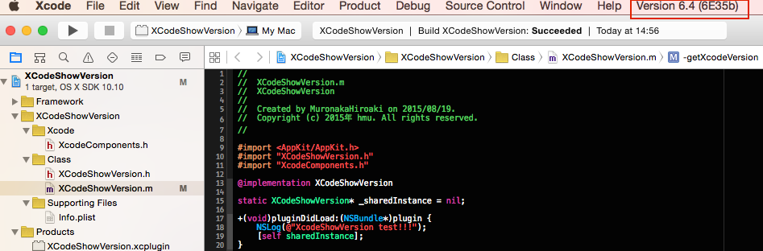

XCodeShowVersion plugin.

Try the plugin! if you often check xcode's version by "About Xcode" window, when you use multiple xcode versions.
This adds xcode version to menu. you can always check it!!

# Install

Please clone or download this project and build it.

# Uninstall

Remove ~/Library/Application Support/Developer/Shared/Xcode/Plug-ins/XcodeShowVersion
